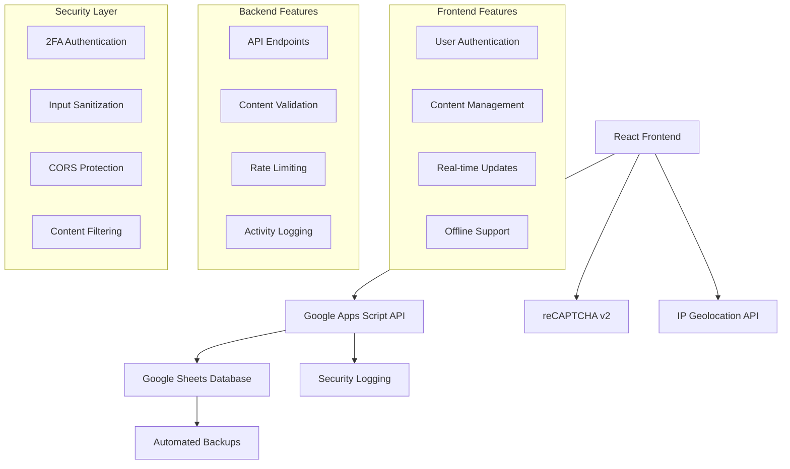

# 🏥 Nursing Webboard - Educational Platform

[](https://github.com/YOUR_USERNAME/nursing-webboard/actions)
[](https://github.com/YOUR_USERNAME/nursing-webboard/actions)
[](./SECURITY.md)
[](./LICENSE)
[](https://codecov.io/gh/YOUR_USERNAME/nursing-webboard)

> 🎓 **Secure Educational Webboard System for Nursing Education with Google Sheets Integration**

A comprehensive, secure webboard platform designed specifically for nursing education, featuring real-time collaboration, medical content validation, and seamless Google Sheets backend integration.


## ✨ Features

### 🏥 **Nursing-Specific Features**
- **Medical Content Validation** - Automatic validation of medical terminology and drug information
- **Case Study Management** - Structured case study creation and sharing
- **Nursing Resources Library** - Centralized repository for nursing protocols and guidelines
- **Clinical Categories** - Specialized categories for different nursing specialties
- **Educational Content Review** - Instructor verification for medical accuracy

### 🔒 **Security & Safety**
- **Two-Factor Authentication (2FA)** - Enhanced security for all users
- **reCAPTCHA v2 Integration** - Bot and spam protection
- **Role-Based Access Control** - Different permissions for students, instructors, and administrators
- **Content Sanitization** - Protection against XSS and injection attacks
- **Rate Limiting** - API abuse prevention
- **Activity Logging** - Comprehensive audit trail with IP tracking

### 🚀 **Technical Features**
- **Google Sheets Backend** - No database server required
- **Real-time Updates** - Live content synchronization
- **Offline Support** - Continue working without internet connection
- **Mobile Responsive** - Works on all devices
- **PWA Ready** - Install as mobile app
- **Performance Optimized** - Fast loading and smooth interactions

### 📊 **Administrative Features**
- **Advanced Analytics** - User behavior and content performance tracking
- **Security Monitoring** - Real-time threat detection and response
- **Content Moderation** - Automated and manual content review tools
- **Data Export** - Backup and reporting capabilities
- **System Health Dashboard** - Monitor system performance and usage

## 🚀 Quick Start

### Prerequisites

- **Node.js** 18+ ([Download](https://nodejs.org/))
- **Google Account** for Google Sheets integration
- **Git** for version control

### 1. Clone & Setup

```bash
# Clone the repository
git clone https://github.com/YOUR_USERNAME/nursing-webboard.git
cd nursing-webboard

# Install dependencies
npm run install:all

# Setup environment variables
npm run setup:env
```

### 2. Configure Google Sheets Backend

1. **Create Google Sheets & Apps Script**:
   ```bash
   # Follow the setup guide
   open docs/backend-setup.md
   ```

2. **Deploy Google Apps Script**:
   - Copy code from `backend/google-apps-script/Code.js`
   - Deploy as Web App
   - Copy the Web App URL

3. **Configure Environment**:
   ```bash
   # Edit .env.local file
   VITE_GOOGLE_SHEETS_API_URL=your_web_app_url
   ```

### 3. Run Development Server

```bash
# Start development server
npm run dev

# Open browser to http://localhost:5173
```

### 4. Test the System

```bash
# Run all tests
npm run test

# Security scan
npm run check:security

# Type checking
npm run type-check
```

## 📚 Documentation

| Document | Description |
|----------|-------------|
| [📋 Installation Guide](./docs/installation.md) | Detailed setup instructions |
| [⚙️ Configuration](./docs/configuration.md) | Environment and feature configuration |
| [🔌 API Reference](./docs/api-reference.md) | Google Sheets API documentation |
| [🔒 Security Guide](./SECURITY.md) | Security policies and best practices |
| [🤝 Contributing](./CONTRIBUTING.md) | How to contribute to the project |
| [📖 User Manual](./docs/user-guide.md) | End-user documentation |

## 🏗️ Architecture



## 🛠️ Development

### Project Structure

```
nursing-webboard/
├── 📁 frontend/          # React TypeScript application
│   ├── 📁 src/
│   │   ├── 📁 components/   # React components
│   │   ├── 📁 utils/        # Utility functions
│   │   ├── 📁 types/        # TypeScript definitions
│   │   └── 📁 styles/       # CSS and styling
│   └── 📄 package.json
├── 📁 backend/           # Google Apps Script backend
│   ├── 📄 Code.js          # Main backend logic
│   └── 📄 appsscript.json  # Apps Script configuration
├── 📁 docs/             # Documentation
├── 📁 scripts/          # Utility scripts
└── 📄 package.json      # Root package configuration
```

### Development Commands

```bash
# Install all dependencies
npm run install:all

# Start development server
npm run dev

# Build for production
npm run build

# Run tests
npm run test

# Lint code
npm run lint

# Type checking
npm run type-check

# Security audit
npm run check:security
```

### Environment Variables

Copy `.env.example` to `.env.local` and configure:

```bash
# Required
VITE_GOOGLE_SHEETS_API_URL=https://script.google.com/macros/s/YOUR_SCRIPT_ID/exec

# Optional
VITE_RECAPTCHA_SITE_KEY=your_recaptcha_site_key
VITE_GA_MEASUREMENT_ID=G-XXXXXXXXXX
VITE_SENTRY_DSN=your_sentry_dsn
```

## 🚀 Deployment

### GitHub Pages (Recommended)

1. **Enable GitHub Pages**:
   - Go to repository Settings > Pages
   - Source: GitHub Actions

2. **Configure Secrets**:
   ```bash
   # Required secrets in GitHub repository settings
   GOOGLE_SHEETS_API_URL=your_web_app_url
   ```

3. **Deploy**:
   ```bash
   # Automatic deployment on push to main branch
   git push origin main
   ```

### Alternative Deployment Options

| Platform | Setup Guide | Auto Deploy |
|----------|-------------|-------------|
| [Vercel](https://vercel.com) | [📖 Guide](./docs/deploy-vercel.md) | ✅ |
| [Netlify](https://netlify.com) | [📖 Guide](./docs/deploy-netlify.md) | ✅ |
| [Firebase](https://firebase.google.com) | [📖 Guide](./docs/deploy-firebase.md) | ✅ |

## 🧪 Testing

### Automated Testing

```bash
# Unit tests
npm run test

# Integration tests
npm run test:integration

# E2E tests
npm run test:e2e

# Security tests
npm run test:security
```

### Manual Testing Checklist

- [ ] User authentication (2FA)
- [ ] Post creation with reCAPTCHA
- [ ] Medical content validation
- [ ] Mobile responsiveness
- [ ] Offline functionality
- [ ] Performance (< 3s load time)

## 📊 Monitoring & Analytics

### Built-in Analytics
- User engagement metrics
- Content performance tracking
- Security incident monitoring
- System health indicators

### External Integrations
- **Google Analytics** - User behavior tracking
- **Sentry** - Error monitoring and performance
- **Uptime monitoring** - Service availability

## 🔒 Security

### Security Features
- 🔐 **2FA Authentication** - All users required
- 🛡️ **reCAPTCHA** - Bot protection on forms
- 🚫 **Content Sanitization** - XSS prevention
- 📝 **Activity Logging** - Full audit trail
- 🚦 **Rate Limiting** - API abuse prevention

### Compliance
- **FERPA** - Educational records protection
- **HIPAA** principles - Healthcare data handling
- **GDPR** - Privacy by design

[📖 Read full security documentation](./SECURITY.md)

## 🤝 Contributing

We welcome contributions from the nursing and developer communities!

### Getting Started
1. Fork the repository
2. Create a feature branch: `git checkout -b feature/amazing-feature`
3. Make your changes
4. Add tests for new functionality
5. Ensure all tests pass: `npm run test`
6. Submit a pull request

### Contribution Types
- 🐛 **Bug fixes**
- ✨ **New features**
- 📚 **Documentation**
- 🧪 **Tests**
- 🏥 **Medical content validation**
- 🌍 **Translations**

[📖 Read contribution guidelines](./CONTRIBUTING.md)

## 📋 Roadmap

### Version 2.1 (Q2 2024)
- [ ] Real-time chat functionality
- [ ] Advanced search with filters
- [ ] Mobile app (React Native)
- [ ] API rate limiting dashboard

### Version 2.2 (Q3 2024)
- [ ] Video content support
- [ ] Interactive case studies
- [ ] Gamification features
- [ ] Advanced analytics

### Version 3.0 (Q4 2024)
- [ ] Multi-language support
- [ ] AI-powered content recommendations
- [ ] Integration with LMS systems
- [ ] Advanced reporting

## 💬 Community & Support

### Getting Help
- 📖 **Documentation**: Check the [docs folder](./docs/)
- 🐛 **Bug Reports**: [Create an issue](https://github.com/YOUR_USERNAME/nursing-webboard/issues)
- 💡 **Feature Requests**: [Submit an idea](https://github.com/YOUR_USERNAME/nursing-webboard/discussions)
- 💬 **Discussions**: [Join conversations](https://github.com/YOUR_USERNAME/nursing-webboard/discussions)

### Community Guidelines
- Be respectful and professional
- Focus on educational value
- Maintain medical accuracy
- Protect student privacy
- Follow code of conduct

## 📄 License

This project is licensed under the MIT License - see the [LICENSE](./LICENSE) file for details.

## 🏥 Medical Disclaimer

This software is designed for **educational purposes only** and should not be used for:
- Clinical decision-making
- Patient care
- Medical diagnosis
- Treatment recommendations

Always consult qualified healthcare professionals for medical advice.

## 👥 Contributors

Thanks to all the contributors who have helped build this project:

<!-- ALL-CONTRIBUTORS-LIST:START -->
<!-- This will be automatically updated -->
<!-- ALL-CONTRIBUTORS-LIST:END -->

## 🌟 Star History

[](https://star-history.com/#YOUR_USERNAME/nursing-webboard&Date)

## 📞 Contact

- **Project Maintainer**: Your Name - your.email@example.com
- **Security Issues**: security@nursing-webboard.edu
- **Medical Content**: medical-review@nursing-webboard.edu

---

<p align="center">
  <strong>Built with ❤️ for nursing education</strong><br>
  <sub>Empowering the next generation of healthcare professionals</sub>
</p>